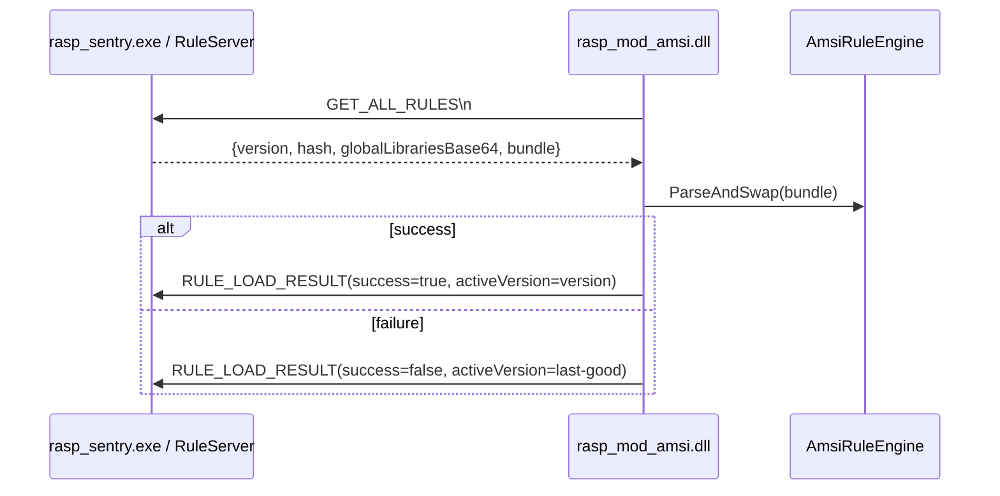
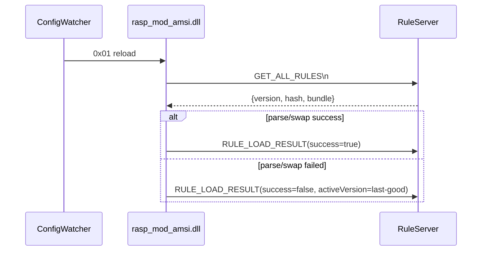
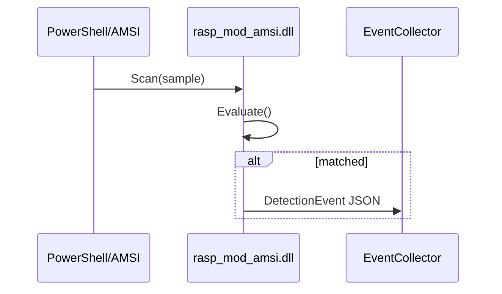
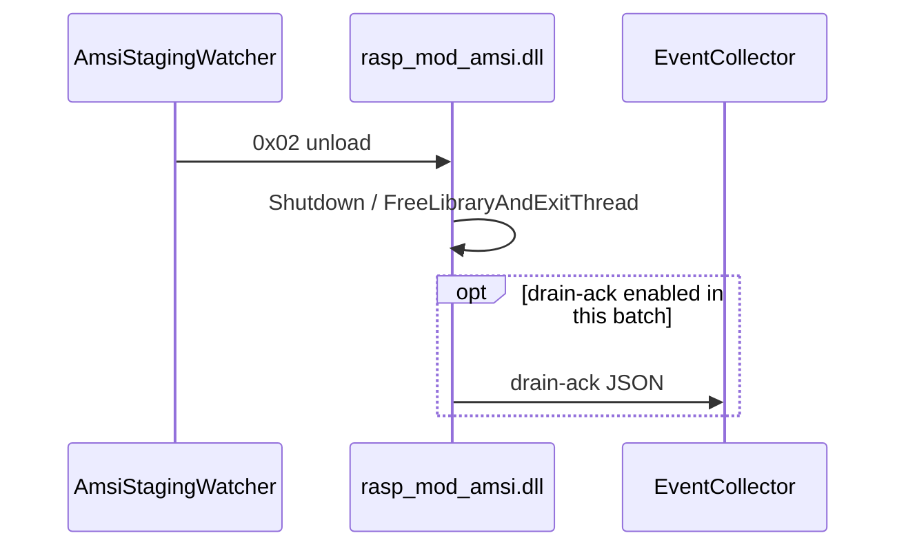

# Phase A Demo 通信实现交付物

日期：2026-05-13

范围：基于当前 `DetectPsByAmsi` demo 工程，为 `PhaseA_通信实现设计_合并版.md` 提供可直接落地的消息面实施方案。

约束：本方案严格区分“当前 demo 实现”和“目标 HostGuard 化架构”。当前不引入 HostGuard/EDR SDK，不实现 HostGuard 内部规则编译、预处理、缓存或持久化体系。

---

## 0. 当前实现边界

本轮只冻结 demo 通信链路，不承诺完整 HostGuard 控制面能力。

必须遵守的边界：

1. 当前仅实现 demo 通信链路，不实现 HostGuard 内部规则编译体系。
2. `rasp_sentry.exe` 只是在当前 demo 中临时扮演 HostGuard 控制面角色。
3. DLL 继续负责本地规则解析、Lua/Regex 预处理和检测执行。
4. `config` 通道继续保留 1-byte `reload/unload` 控制信号。
5. `events` 通道当前继续承载 `DetectionEvent + DiagLog`。
6. `control_status` 当前只承载 `RULE_LOAD_RESULT`。
7. 当前不做 Prepared Bundle 二进制格式。
8. 当前不做 config pipe JSON 化。
9. 当前不拆 detection/diag 独立总线。

文档中的 `bundle` 只表示“规则响应 envelope 中的承载体”，不表示 HostGuard 已经完成编译或预处理的 Prepared Bundle。

---

## 1. 当前结论

当前 demo 已经具备三条可运行的 IPC 通道原型：

1. 规则拉取：`rasp_sentry_rules`
2. 控制广播：`rasp_sentry_config`
3. 事件上报：`rasp_sentry_events`

对应代码：

- [src/rasp_rule_engine/src/rasp_sentry_base.cpp](D:\Code\rasp\DetectPsByAmsi\src\rasp_rule_engine\src\rasp_sentry_base.cpp)
- [src/rasp_sentry_native/src/rule_server.cpp](D:\Code\rasp\DetectPsByAmsi\src\rasp_sentry_native\src\rule_server.cpp)
- [src/rasp_sentry_native/src/event_collector.cpp](D:\Code\rasp\DetectPsByAmsi\src\rasp_sentry_native\src\event_collector.cpp)
- [src/rasp_sentry_native/src/config_watcher.cpp](D:\Code\rasp\DetectPsByAmsi\src\rasp_sentry_native\src\config_watcher.cpp)
- [src/rasp_sentry_native/src/amsi_staging_watcher.cpp](D:\Code\rasp\DetectPsByAmsi\src\rasp_sentry_native\src\amsi_staging_watcher.cpp)

相对 `PhaseA_通信实现设计_合并版.md`，当前 demo 最缺的是：

1. `control_status` 独立通道
2. 规则响应 envelope 中的 `version/hash/bundle`
3. DLL 规则加载结果回报 `RULE_LOAD_RESULT`

当前最优路径：

1. 让 `rasp_sentry.exe` 暂时承担 HostGuard demo 控制面职责。
2. 在现有 3 条 pipe 基础上补第 4 条状态 pipe。
3. 保持 DLL 继续负责本地解析与检测。
4. 先把消息语义和可观测性跑通，再讨论 HostGuard 内部规则体系。

---

## 2. 本次建议交付物

本次建议冻结以下 5 类交付物：

1. 4 条 pipe 的命名与方向
2. rules / config / control_status / events 的消息 schema
3. 规则拉取、reload、DetectionEvent、unload 的时序图
4. 当前 demo 的文件级改造清单
5. 分阶段实施顺序与验收标准

---

## 3. 目标通道定义

### 3.1 目标命名

建议 Phase A 统一收口为以下 4 条命名管道：

| Pipe | 方向 | 用途 |
|---|---|---|
| `\\.\pipe\amsi_detect_rules` | DLL -> EXE | DLL 拉取当前 active 规则包 |
| `\\.\pipe\amsi_detect_config` | EXE -> DLL | EXE 广播 `reload(0x01)` / `unload(0x02)` |
| `\\.\pipe\amsi_detect_control_status` | DLL -> EXE | DLL 回报 `RULE_LOAD_RESULT` |
| `\\.\pipe\amsi_detect_events` | DLL -> EXE | DetectionEvent / DiagLog，后续可继续承载 drain-ack |

### 3.2 当前实现映射

| 当前实现 | 目标名称 | 当前代码 |
|---|---|---|
| `\\.\pipe\rasp_sentry_rules` | `\\.\pipe\amsi_detect_rules` | `RuleServer` / `ConnectSentry()` |
| `\\.\pipe\rasp_sentry_config` | `\\.\pipe\amsi_detect_config` | `ConfigWatcher` / `ConfigPipeThreadProc()` |
| 无 | `\\.\pipe\amsi_detect_control_status` | 需要新增 |
| `\\.\pipe\rasp_sentry_events` | `\\.\pipe\amsi_detect_events` | `EventCollector` / `SendDetectionEvent()` / `LogForwardThreadProc()` |

### 3.3 当前推荐兼容策略

建议当前 demo 分两步切换：

1. EXE 支持新旧 pipe 名称兼容，DLL 优先用新名，失败回退旧名。
2. 联调稳定后，再移除 `rasp_sentry_*`。

这样可以避免一次性切断当前已可运行的 demo 通信链路。

---

## 4. 具体消息 schema

## 4.1 Rules pipe

### 4.1.1 请求

当前 demo 推荐保留现有最小请求，不先改成复杂结构化请求：

```text
GET_ALL_RULES\n
```

可选兼容：

```text
GET_RULES\n
```

### 4.1.2 响应

建议 EXE 返回带 envelope 的 JSON：

```json
{
  "version": "2026051301",
  "hash": "sha256:abcd1234",
  "globalLibrariesBase64": ["..."],
  "bundle": {
    "rules": [
      {
        "id": "rule-1",
        "sensor": "AmsiProvider",
        "enabled": true,
        "description": "demo rule",
        "severity": "high",
        "scriptBodyBase64": "...",
        "scriptEval": "eval",
        "confidence": 80,
        "mode": "block",
        "scriptTimeoutMs": 1000,
        "config": {
          "regexField": "body",
          "regexPatterns": ["Invoke-Expression"],
          "regexChecks": [
            {
              "id": "ck1",
              "field": "body",
              "patterns": ["IEX", "Invoke-Expression"]
            }
          ],
          "regexCondition": "any"
        }
      }
    ]
  }
}
```

说明：

- 当前 `bundle` 只是规则 JSON 的 envelope 承载体。
- 当前 `bundle` 不代表 HostGuard 侧已经完成 Lua 预编译、Regex 预处理或快照构建。
- DLL 仍然负责本地 `ParseRulesJson()`、规则过滤、Lua/Regex 准备和检测执行。

### 4.1.3 DLL 侧兼容规则

DLL 解析入口建议做两层兼容：

1. 顶层有 `bundle` 时，从 `bundle.rules` 解析。
2. 没有 `bundle` 时，按旧逻辑继续从顶层 `rules` 解析。

这样可兼容当前旧式 `GET_ALL_RULES` 返回结构。

---

## 4.2 Config pipe

### 4.2.1 保留单字节控制信号

当前 demo 阶段不建议把 config pipe 改成 JSON，继续保留：

- `0x01`：reload
- `0x02`：unload

理由：

- 当前代码已实现并跑通。
- 语义简单。
- 不需要额外消息头和版本协商。

### 4.2.2 触发语义

| 信号 | 发送方 | 接收方 | 当前建议语义 |
|---|---|---|---|
| `0x01` | EXE/ConfigWatcher | DLL/ConfigPipeThreadProc | 重新拉取规则并尝试替换快照 |
| `0x02` | EXE/AmsiStagingWatcher | DLL/ConfigPipeThreadProc | 进入 unload/inert 流程；drain-ack 是否本轮必须由实现批次单独确认 |

---

## 4.3 Control status pipe

这是当前建议新增的核心通道。

### 4.3.1 消息类型

当前只定义一种消息：

```json
{
  "msgType": "RULE_LOAD_RESULT",
  "module": "amsi_detect",
  "dllInstanceId": "amsi_detect_1234",
  "pid": 1234,
  "timestamp": "2026-05-13T10:00:00Z",
  "requestedVersion": "2026051301",
  "requestedHash": "sha256:abcd1234",
  "activeVersion": "2026051301",
  "activeHash": "sha256:abcd1234",
  "success": true,
  "ruleCount": 15,
  "errorCode": 0,
  "errorMessage": ""
}
```

### 4.3.2 字段语义

| 字段 | 含义 |
|---|---|
| `requestedVersion/hash` | 本次拉取到、尝试装载的版本 |
| `activeVersion/hash` | 当前实际生效的 last-good snapshot 版本 |
| `success` | 本次装载是否成功 |
| `ruleCount` | 当前生效快照的规则数 |
| `errorCode/errorMessage` | 拉取、解析、预编译、替换失败时的错误信息 |

### 4.3.3 最小错误码表

| errorCode | 语义 |
|---|---|
| `0` | 成功 |
| `1` | rules pipe 连接失败或读取失败 |
| `2` | 响应 JSON 非法或缺少必要字段 |
| `3` | 规则解析、Lua 预处理或装载失败 |
| `4` | 本次规则未生效，继续保持旧规则 |

错误码只表达大类，详细原因放在 `errorMessage`。

### 4.3.4 发送时机

DLL 侧应至少在以下两个场景发送：

1. 初始化首次 `ConnectSentry() + ParseAndSwap()` 完成后。
2. `OnReloadSignal()` 完成后。

如果 reload 失败：

- `success = false`
- `activeVersion/hash` 保持旧值
- `requestedVersion/hash` 写新值
- `errorCode` 至少应能区分连接失败、JSON 非法、装载失败和保持旧规则。

---

## 4.4 Events pipe

当前 demo 阶段继续走 JSON 文本，不先做复杂总线协议。

### 4.4.1 事件优先级原则

当前 `amsi_detect_events` 虽然共通道承载 `DetectionEvent` 和 `DiagLog`，但 Host 侧处理顺序必须保证：

1. `DetectionEvent` 优先于 `DiagLog`
2. `DiagLog` 可采样、限流、截断或丢弃
3. `DetectionEvent` 可以在队列满时按策略丢弃，但必须计数

当前 demo 如果暂时仍按到达顺序落盘，需要在实现说明中标注这是 demo 简化行为，不代表最终优先级策略。

### 4.4.2 DetectionEvent

```json
{
  "id": "evt-1",
  "ts": "2026-05-13T10:00:00Z",
  "sev": "high",
  "act": "block",
  "cat": "Detection",
  "mod": "rasp_mod_amsi",
  "sensor": "AmsiProvider",
  "rule": "rule-1",
  "desc": "blocked by demo rule",
  "appName": "powershell.exe",
  "contentName": "Invoke-Expression",
  "confidence": "80",
  "ip": "",
  "ua": "",
  "pattern": "Invoke-Expression",
  "dllInstanceId": "amsi_detect_1234",
  "pid": 1234
}
```

说明：

- 当前 repo 里还没有稳定的 `parentPid / parentProcessName` 生产实现，本轮不强加。
- 如后续补齐进程上下文，可再把父进程字段扩展到事件层。

### 4.4.3 DiagLog

```json
{
  "id": "log-1",
  "ts": "2026-05-13T10:00:00Z",
  "sev": "info",
  "act": "audit",
  "cat": "DiagLog",
  "mod": "rasp_mod_amsi",
  "sensor": "RaspLog",
  "rule": "",
  "desc": "reload signal received",
  "method": "",
  "url": "",
  "ip": "",
  "ua": "",
  "pattern": "amsi-log",
  "payload": "",
  "dllInstanceId": "amsi_detect_1234",
  "pid": 1234
}
```

### 4.4.4 drain-ack

`drain-ack` 当前已有旧链路。是否纳入本轮 Phase A 必须项，需要由实现批次单独确认。

如果纳入 `amsi_detect_events`，建议格式为：

```json
{
  "cat": "drain-ack",
  "mod": "rasp_mod_amsi",
  "pid": 1234,
  "dllInstanceId": "amsi_detect_1234"
}
```

如果本轮只做规则 reload 与事件上报，则 `drain-ack` 可保留在后续生命周期增强批次。

---

## 5. 规则流转时序图

### 5.1 冷启动拉规则



### 5.2 reload



### 5.3 DetectionEvent



### 5.4 unload / drain-ack



---

## 6. 当前 demo 文件级改造清单

## 6.1 EXE 侧

### A. RuleServer

文件：

- [src/rasp_sentry_native/src/rule_server.cpp](D:\Code\rasp\DetectPsByAmsi\src\rasp_sentry_native\src\rule_server.cpp)
- [src/rasp_sentry_native/include/rule_server.h](D:\Code\rasp\DetectPsByAmsi\src\rasp_sentry_native\include\rule_server.h)

建议改动：

1. 支持新 pipe 名：`amsi_detect_rules`
2. 规则响应增加顶层 envelope：
   - `version`
   - `hash`
   - `bundle`
3. 保持旧 `GET_ALL_RULES` 请求语义不变

### B. ConfigWatcher

文件：

- [src/rasp_sentry_native/src/config_watcher.cpp](D:\Code\rasp\DetectPsByAmsi\src\rasp_sentry_native\src\config_watcher.cpp)
- [src/rasp_sentry_native/include/config_watcher.h](D:\Code\rasp\DetectPsByAmsi\src\rasp_sentry_native\include\config_watcher.h)

建议改动：

1. 使用 `amsi_detect_config`
2. 保持 `0x01 reload` 单字节信号
3. 广播 listener 计数日志保留

### C. AmsiStagingWatcher

文件：

- [src/rasp_sentry_native/src/amsi_staging_watcher.cpp](D:\Code\rasp\DetectPsByAmsi\src\rasp_sentry_native\src\amsi_staging_watcher.cpp)
- [src/rasp_sentry_native/include/amsi_staging_watcher.h](D:\Code\rasp\DetectPsByAmsi\src\rasp_sentry_native\include\amsi_staging_watcher.h)

建议改动：

1. 统一 `kConfigPipeName` 到完整的 `amsi_detect_config` 路径
2. 保持 `0x02 unload` 单字节信号

### D. EventCollector

文件：

- [src/rasp_sentry_native/src/event_collector.cpp](D:\Code\rasp\DetectPsByAmsi\src\rasp_sentry_native\src\event_collector.cpp)
- [src/rasp_sentry_native/include/event_collector.h](D:\Code\rasp\DetectPsByAmsi\src\rasp_sentry_native\include\event_collector.h)

建议改动：

1. 使用 `amsi_detect_events`
2. 接收 `Detection` / `DiagLog`
3. `drain-ack` 是否纳入本轮，由生命周期批次单独确认
4. 当前 demo 可继续统一落盘到 JSONL，但文档中必须说明 DetectionEvent 优先于 DiagLog 是目标要求

### E. 新增 ControlStatusCollector

建议新增文件：

- `src/rasp_sentry_native/include/control_status_collector.h`
- `src/rasp_sentry_native/src/control_status_collector.cpp`

职责：

1. 监听 `amsi_detect_control_status`
2. 接收 `RULE_LOAD_RESULT`
3. 先做日志输出或 JSONL 落盘
4. 不要求当前阶段接入更复杂状态机

---

## 6.2 DLL 侧

### A. RaspSentryBase

文件：

- [src/rasp_rule_engine/include/rasp_sentry_base.h](D:\Code\rasp\DetectPsByAmsi\src\rasp_rule_engine\include\rasp_sentry_base.h)
- [src/rasp_rule_engine/src/rasp_sentry_base.cpp](D:\Code\rasp\DetectPsByAmsi\src\rasp_rule_engine\src\rasp_sentry_base.cpp)

建议改动：

1. `ConnectSentry()` 优先连接 `amsi_detect_rules`
2. 兼容新 envelope 与旧规则 JSON
3. `ConfigPipeThreadProc()` 监听 `amsi_detect_config`
4. `SendDetectionEvent()` / `LogForwardThreadProc()` 发往 `amsi_detect_events`
5. 新增 `SendRuleLoadResult()`，写到 `amsi_detect_control_status`

### B. AmsiRuleEngine

文件：

- [src/rasp_mod_amsi/include/amsi_rule_engine.h](D:\Code\rasp\DetectPsByAmsi\src\rasp_mod_amsi\include\amsi_rule_engine.h)
- [src/rasp_mod_amsi/src/amsi_rule_engine.cpp](D:\Code\rasp\DetectPsByAmsi\src\rasp_mod_amsi\src\amsi_rule_engine.cpp)

建议改动：

1. 在首次 `ParseAndSwap()` 后发送 `RULE_LOAD_RESULT`
2. 在 `OnReloadSignal()` 路径里成功/失败都发送 `RULE_LOAD_RESULT`
3. 保留 last-good snapshot 语义
4. `drain-ack` 仍然发到 `events` 通道，是否纳入本轮必须项单独确认

### C. DLL instance identity

建议增加：

```text
dllInstanceId = amsi_detect_<pid>
```

当前阶段不需要引入全局 UUID，先保证实例级可区分即可。

---

## 7. 分阶段实施顺序

## Phase A1：补状态回报通道

目标：

- 新增 `amsi_detect_control_status`
- DLL 能在初始化/reload 后回 `RULE_LOAD_RESULT`

允许改动：

- EXE 新增 `ControlStatusCollector`
- DLL 新增 `SendRuleLoadResult()`

禁止改动：

- 不改检测逻辑
- 不改规则语义
- 不改 Lua/Regex 执行模型

验收：

- 首次加载能看到 `RULE_LOAD_RESULT(success=true/false)`
- reload 能看到对应回报
- `errorCode` 符合最小错误码表

## Phase A2：规则响应 envelope 升级

目标：

- `version/hash/bundle` 进入 rules pipe

允许改动：

- `RuleServer` 响应结构
- DLL 顶层 JSON 兼容解析

禁止改动：

- 不改规则内部字段语义
- 不实现 Prepared Bundle 二进制格式

验收：

- DLL 能解析新旧两种 rules 响应
- 失败时仍保留旧快照
- `bundle` 仅作为 envelope 承载体使用

## Phase A3：统一通道名

目标：

- 切换到 `amsi_detect_*`

允许改动：

- 新旧双栈兼容

禁止改动：

- 不一次性删除旧 pipe 兼容

验收：

- rules/config/events/control_status 四条新通道可跑通

## Phase A4：统一事件类别与字段

目标：

- `Detection` / `DiagLog` / 可选 `drain-ack` 事件字段统一

允许改动：

- 事件 JSON 字段补齐

禁止改动：

- 不引入异步事件总线大改
- 不拆 detection/diag 独立总线

验收：

- EventCollector 能区分 DetectionEvent 和 DiagLog
- DetectionEvent 优先级要求在 Host 侧设计中明确
- DiagLog 可限流、采样或截断

---

## 8. 当前不建议立即做的事项

以下事项不纳入当前 demo 第一轮交付：

1. Prepared Bundle 二进制格式
2. `AsyncEventQueue`
3. `EventJsonBuilder` 全量重写
4. config pipe JSON 化
5. HostGuard/EDR SDK 接入
6. 父进程上下文字段强绑定到事件 schema
7. detection/diag 独立总线与优先级队列
8. HostGuard 内部规则编译、预处理、缓存和持久化体系

---

## 9. 建议评审门禁

建议本轮评审至少确认以下 8 点：

1. 4 条 pipe 命名是否冻结
2. `RULE_LOAD_RESULT` 字段是否冻结
3. `RULE_LOAD_RESULT.errorCode` 最小错误码表是否冻结
4. rules response envelope 是否冻结
5. `bundle` 是否明确为 envelope 承载体，而非 Prepared Bundle
6. reload/unload 是否继续保留 1-byte 信号
7. 当前阶段是否接受 `rasp_sentry.exe` 暂时承担 HostGuard demo 职责
8. 是否接受新旧 pipe 双栈过渡

---

## 10. 本地保存说明

本文档是针对当前 demo 的具体交付物，不等价于最终 HostGuard/EDR 目标架构。

它的定位是：

1. 先把消息面跑通
2. 先把规则加载结果可观测
3. 先把 4 条 pipe 语义固定
4. 在不大改当前检测链路的前提下，为后续迁移打底

---

## 11. A2 Optional Rule Metadata Policy

This demo supports optional rule response metadata, but production rule loading
does not depend on `version` or `hash`.

Current rules:

1. `version` and `hash` are pass-through fields only.
2. If HostGuard / demo sentry provides them, DLL reports them in
   `RULE_LOAD_RESULT`.
3. If they are missing, DLL reports empty strings.
4. DLL must not derive, fake, hash, or hard-code these fields.
5. `RULE_LOAD_RESULT.success` only means rule fetch and load succeeded. It does
   not mean metadata is complete.

`bundle` in the demo schema is only the carrier inside the rule response
envelope. It is not a prepared or precompiled HostGuard bundle.

Filling rules:

| Scenario | requestedVersion/hash | activeVersion/hash |
|---|---|---|
| Provided metadata + load success | provided value | provided value |
| Missing metadata + load success | empty | empty |
| Load failed with last-good snapshot | current response value or empty | last-good value or empty |
| Load failed with no last-good snapshot | current response value or empty | empty |
